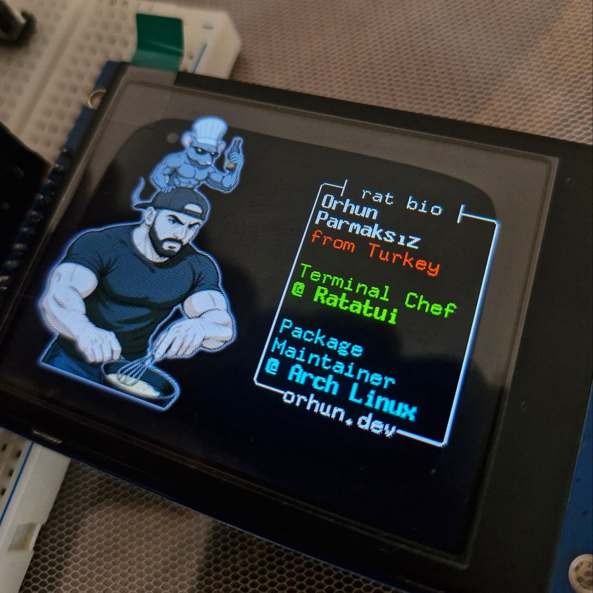
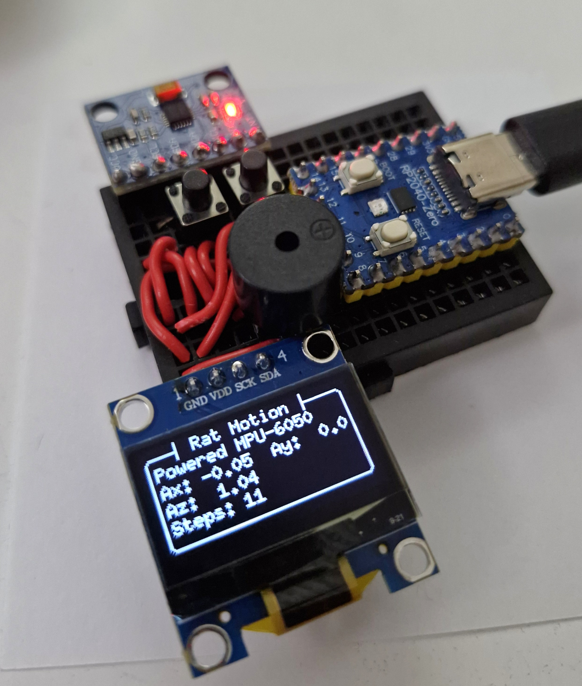
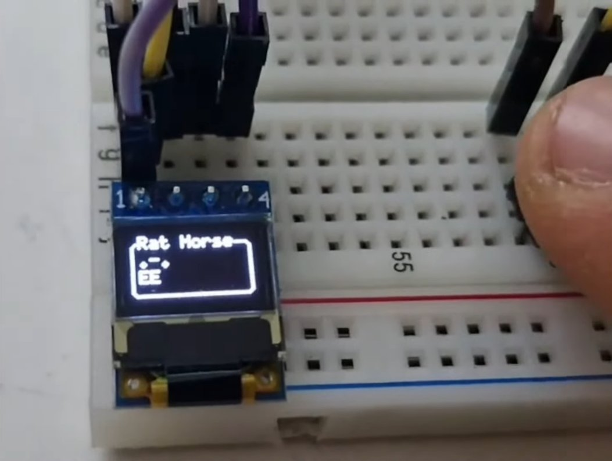

# rat-tools 🐀📟


A collection of Rust/[Ratatui](https://ratatui.rs/) embedded projects targeting [RP2040-Zero](https://www.waveshare.com/wiki/RP2040-Zero).

> [!NOTE]  
> Originally prepared for the [RustNation UK](https://www.rustnationuk.com) conference and the development process is livestreamed on [my YouTube channel](https://www.youtube.com/@orhundev).

## [ratdeck](https://github.com/orhun/rat-tools/tree/main/ratdeck)

An embedded slideshow/presentation tool.

- 320x240 ST7789 display
- Build-time slide generation from Markdown (see [slides.md](ratdeck/slides.md))
- Bundled images/assets
- Desktop simulator binary for development



## [cheese-locator](https://github.com/orhun/rat-tools/tree/main/cheese-locator)

A standalone game for locating the cheese.

- 128x64 SSD1306 display
- MPU-6050 IMU for tracking movement
- Buzzer for decoding Morse code clues



## [antui](https://github.com/orhun/rat-tools/tree/main/antui)

The smallest TUI application built for ants.

- 72x40 SSD1306 display



# Development

## Prerequisites

- [Rust](https://www.rust-lang.org/tools/install)
  - Run `rustup target add thumbv6m-none-eabi` to add the RP2040 target.
- [elf2uf2-rs](https://github.com/JoNil/elf2uf2-rs)
- SDL2 (needed for the [simulator](#simulator))

## Building and Flashing

UF2 flashing is the default method, but you can also use SWD with a probe if you prefer.

1. Hold the BOOT button and plug in the USB to mount the `RPI-RP2` drive.
2. Build the project: `cargo build --release --target thumbv6m-none-eabi -p <project>`
3. Mount the drive, e.g. `sudo mount /dev/sdX1 /mnt/rp2` (replace `sdX1` with the correct device).
4. Flash the UF2: `elf2uf2-rs deploy --family rp2040 target/thumbv6m-none-eabi/release/<project>`
5. Unmount the drive: `sudo umount /mnt/rp2`

## Simulator

Only supported for [ratdeck](#ratdeck) at the moment, but you can run the simulator on your desktop for faster iteration:

```sh
cargo run -p ratdeck --features simulator --bin simulator
```

# Credits

[](./LICENSE-MIT)

Licensed under [The MIT License](./LICENSE-MIT).

Copyright © 2025, [Orhun Parmaksız](mailto:orhunparmaksiz@gmail.com)

> 🦀 ノ( º \_ º ノ) - respect crables!
